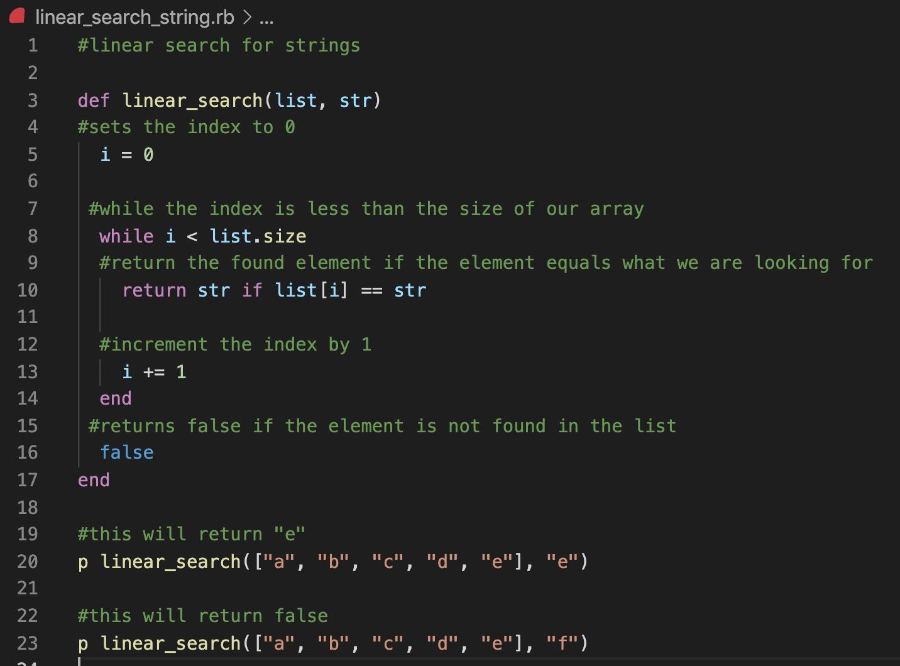

# Identify and explain the workings of TWO sorting algorithms and discuss and compare their performance/efficiency (i.e. Big O) (300-500)

### Link to repo containing code can be found [here:](https://github.com/IsaacCavallaro/IsaacCavallaro_T2_A1-B)

## Big O and sorting overview

- Big O is the theoretical definition of the complexity of an algorithm.

- It is a notation we use to describe the **complexity** of an algorithm. 

- Additionally, Big O is a useful for understanding both the time and space complexity of algorithms.

- **Sorting** is considered as method in which we can arrange data in a specific order.

- This sorting helps searching algorithms find elements quickly.

- There are various sorting algorithms but this will cover **Bubble sort** and **Selection Sort**.

- Before investigating **Bubble sort** and **Selection Sort**, it is important to understand how to measure the efficiency of an algorithm.

## Measuring Efficiency (Time & Space)

- Complexity is relative.
- Therefore, when evaluating the complexity of **Bubble sort**, it is relative to other sort algorithms and not all algorithms (search algorithms for example).

### Time complexity

- This refers to the running time of an algorithm.

- When efficiency of time complexity, the worse case scenarios are the benchmark given an algorithm will never perform worse than its worse case.

### Space Complexity 

- This refers to the storage taken up by an algorithm.

- Therefore space complexity refers deals with the amount of memory taken up on the computer in order to execute the algorithm.

- A good algorithm with balance between both measurements; Time and Space complexity.

- For example, an algorithm may be very fast but it is not very useful it the algorithm consumes more memory than available.

## 1. Bubble sort

- One example of a simple sorting algorithm is *Bubble Sort* which is a **comparison-based algorithm**. This means that each pair of adjacent elements is compared and then the elements are swapped if they are not in order. This is done by comparing each element based on their values.

### Example of an unsorted array:

      unsorted_array = [40,30,10,70,50,20,60]

- In this example, we have an unsorted array, meaning the elements are not sorted in order of their value. 

### Example of the above array when it is sorted:

        sorted_array = [10,20,30,40,50,60,70] 

- In this example, we have the same values as the unsorted array but now they are sorted, meaning the elements are in ascending order from the lowest value to the highest value.

- This sorting of the array is what *Bubble Sort* does. If an array is to be sorted in ascending order (as in the above example), *Bubble Sort* will begin by comparing the first element in the array with the second element. If *Bubble Sort* detects the first element is greater than the second element, it will swap the elements.

## Breaking down the steps to sorting our unsorted_array with bubble sort.

        unsorted_array = [40,30,10,70,50,20,60]

1. **First step** is to look at our first pair 40 and 30. Given 30 is less than 40, those two numbers will be swapped.

        unsorted_array = [30,40,10,70,50,20,60]

2. **Next step** is to look at our next pair 40 and 10. Given 10 is less than 40. Those two numbers will be swapped.

        unsorted_array = [30,10,40,70,50,20,60]

3. **Next step** is to look at our next pair 40 and 70. Given 70 is greater than 40, there is no need for swapping the numbers.

4. **Next step** is to look at our next pair 70 and 50. 

- 50 is less than 70. So those two numbers will be swapped.

        unsorted_array = [30,10,40,50,70,20,60]

5. **Next step** is to look at our next pair 70 and 20.  

- 20 is less than 70 so those two numbers will be swapped.

        unsorted_array = [30,10,40,50,20,70,60]

6. **Next step** is to look at our next pair 70 and 60. Given 60 is less than 70. Those two numbers will be swapped.

        unsorted_array = [30,10,40,50,20,60,70]

- At this point we have reached the **first pass**, meaning each element has been checked.

- This process of checking each pair will continue until the array is sorted. 

- In this example, the **second pass** will start where the first pass ended (see code below):

        unsorted_array = [30,10,40,50,20,60,70]

- Importantly, the final pass will include checking all pairs and if this are no swaps required, the *Bubble Sort* algorithm will be finished. 

## Another example 

            unsorted_array = [5,1,6,2,4,3]

## Bubble sort Complexity 

- **The Best Case** Time Complexity for *Bubble Sort* is **linear** which represents the complexity that increases linearly and in direct proportion to the number of inputs.

  - A linear algorithm – O(n) 

- **The Worst Case** Time Complexity for *Bubble Sort* is quadractic which is a complexity that is directly proportional to the **square of the input size.** This means that the efficiency of *Bubble Sort* will decrease significantly as the number of elements grows.

   - quadratic time O(n2)

- This is illustrated in the images below:

## Bubble sort example in Ruby:

A link to the code can be found [here:](https://github.com/IsaacCavallaro/IsaacCavallaro_T2_A1-B/blob/main/bubble_sort.rb)

## Bubble sort Performance/Efficiency 

One of *Bubble sorts* advantages is its simplicity. In fact, it is the simplest type of **sorting algorithm.**

This is why *Bubble sort* does not get used much in real-world computer science. Rather, *Bubble sort* is generally used:

1. To learn basic sorting.

2. As a methodology for sorting small datasets.

3. As a sorting methodology for datasets that are mostly in order. 

## 2. Selection Sort

- *Selection sort* is an in-place comparison sorting algorithm.

- *Selection sort* divides into two parts:

  - The sorted part at the left end of the list.
        
  - The unsorted part at the right end of the list. 

- Initially, the sorted part is empty and the unsorted part is the entire list.

- Other implementations of selection sort use two arrays: an unsorted array and a sorted one. 

- The sorted list starts out empty, and gradually values are moved from the unsorted list to the sorted list one at a time. 

- With each iteration, the smallest value from the unsorted array will be selected and moved to the sorted array.

### Example of an unsorted array:

      unsorted_array = [14,33,27,10,35,19,42,44]

### Example of a sorted array:

        sorted_array = [10,14,19,27,33,35,42,44] 

## Breaking down the steps to sorting our unsorted_array with selection sort.

1. First step *Selection Sort* will sequentially scan the whole list and search for the **lowest value** in the unsorted array relative to the first position in the unsorted array. In this example, that would be 10 given 14 is in the first position (index 0 in ruby language). This is illustrated in the image below:

2. Therefore, after the first iteration, 14 and 10 are swapped (see image below)

3. Next,  *Selection Sort* will scan the list looking for the **next lowest value** relative to the now sorted element  10 at index 0. 

- In this manner, 14 and 33 will be swapped as 14 is the second lowest value in this list. 

- In this example, after two iterations the two lowest values are now sorted.

- This process is applied to each element of the list (see image below)

## Selection sort with two arrays

       unsorted_arr = [8, 5, 1, 4, 7]

-  The image above illustrates the  movement of numbers from the unsorted array to the sorted array.

- In this case, **Selection sort** works by selecting the smallest element in the unsorted array and then add this element to the **Sorted array.**

## Selection sort Complexity 

- **The Best Case** Time complexity for *Selection Sort* is О(n2) for comparisons and O(1) for swaps.

- **The Worst Case** Time complexity for *Selection Sort* is О(n2) for comparisons, and О(n) for swaps.

## Bubble sort vs Selection Sort

- One of the key differences between *Bubble sort* and *Selection sort* is:

  - *Bubble sort* works by repeatedly **swapping** adjacent elements if they are in the wrong order.

  - *Selection sort* repeatedly finds the **lowest value** element from the unsorted part and places that element at the beginning of the array (or second array depending on use case).

- The **worst case** complexity is same in both *Bubble sort* and *Selection sort*:

  - O(n2)

- The **best case** complexity differs between *Bubble sort* and *Selection sort.*

  -  *Bubble sort* operates with an order of **n time**. 
  
  - *Selection sort* operates with an order of **n2 time.**

- Another key difference is *Selection sort* is fast and efficient when compared to *Bubble sort.* 

- Additionally, *Bubble sort* is a **stable algorithm** whereas *selection sort* is **unstable.**

- Another key difference is *Bubble sort* requires **additional space** for storing temporary variables.

For animations of sorting algorithms click [here:](https://www.toptal.com/developers/sorting-algorithms
)

# Identify and explain the workings of TWO search algorithms and discuss and compare their performance/efficiency (i.e. Big O) (300-500)

### Search algorithms are not limited to searching lists which contain integers; they can search lists containing all kinds of data.

## Linear Search

- *Linear search* refers to an algorithm that **sequentially reads input.**

  - Therefore, any time a problem involves reading every item in a list, it will have a linear runtime.

### "Real World" Example 1: 

- A parent picks his childs toys up from the floor one at a time. This would be generalised as a runtime of O(n); *Linear search*.

## Linear Search Ruby Code:

Link to this code can be found [here:](https://github.com/IsaacCavallaro/IsaacCavallaro_T2_A1-B/blob/main/linear_search_string.rb)

## Time Complexity Analysis: Linear Search
 
- The **best case** for *Linear search* is when the **target value** element is in the first position (index 0 in ruby). 

- In this case, *Linear search* will just take one iteration and therefore will be O(1). 

- In **the worst case**, linear search will be O(n) which is linear.

## Binary Search Overview

- Binary Search searches a sorted array by **repeatedly dividing the search interval in half**. 

- This is referred to as the **divide and conquer method.** 

- In other words, binary search will **continuously divide** the array into two halves until the **target value** is found. 

- This can also be applied to a **binary search tree.** 

- The beauty of binary search is that with each iteration, half of the elements are elimiated. 

## Binary Search Tree Example:

- In this example, our target value is the **integer value: 3**

- **Step 1:** Is our target value equal to, less than or greater than our root node?

  - Our target value 3 is less than our root node 5. Therefore we can discard the right side of our binary search tree.

  - This is because all values to the left will be less than its parent node (or root node in this case) and all values to the right will be greater than the parent node.

- **Step 2:** 

- We ask this same question but with our new postion which is the node of value 2. 

### *Is our target value equal to, less than or greater than the node we are occupying?*

- This time, our target value 3 is greater than the node we are currently visiting so we will discard the left side of binary search tree from the node with the value 2. 

- **Step 3:** 

- We ask this same question:

### *Is our target value equal to, less than or greater than the node we are occupying?*

- In this case our target value 3 matches the nodes value we are currently visiting. 

## Binary Search Ruby Example:

link to code can be found [here:](https://github.com/IsaacCavallaro/IsaacCavallaro_T2_A1-B/blob/main/binary_search.two.rb)

**The input:**

  - A **sorted list** of values (eg: array/binary tree)
  - *Binary search* Algorithm can be applied only on **sorted arrays.** (ie: Arrays need to be sorted first to perform *Binary search* on an array)

**The output:**

  - The position in the list of the **target value** we're searching for,
  - Or some sort of values indicating the target value is not in the list. **False** for example.

## Binary Search 

- **Best case**  -  O(1)
- **Worst Case** -  O (log n)
- **Average Case** - O(log n)

## Logarithmic Algorithm Breakdown

- *Binary search* is considered a logarithmic search algorithm as its worst case is O(log n).

- This mean the number of times *Binary search* runs **increases logarithmically** with the number of elements it has to search.

- In big O notation, a logarithmic runtime is represented as O(log n).

- Importantly, any algorithm which cuts the problem in half each time is O(log n).

- A logarithm can be defined as,

*A quantity representing the power to which a fixed number (the base) must be raised to produce a given number.*

- Unlike exponentials, which grow very rapidly, the logarithm function grows very slowly.

- In fact, a logarithmic function it the **inverse of an exponential.**

- To understand **Logarithmic Algorithms** we can ask this question: 

### *How many iterations are required to get to one element/item?*

- This is because *Binary search* always ends up with a **single element.**

- This single element may be the **target value** we are searching for,

- Or it could be the **closest value** to our target value (and thus, it would not be in our list).

- In both cases, the data will be repeatidly split in half until one element is left. 

- For example, if we have 16 items in a list, *Binary search* will: 
    -  Divide the data set in half four times until it is left with to **just one item.** 

    - Divide 16 by 2, then divide 8 by 2, then 4 by 2, and finally 2 by 2.

- Another way to think of this is that dividing by 2 is the same as multiplying by 1/2. 

- Therefore, with 16 items, the dataset can be multiplied by 1/2, 4 times which will leave one item.

- Given we are dividing the list by two and that in programming, we are generally dealing with binary numbers, logarithms are **often in base 2** when considered with programming. 

- The image below illustrates this relationship in base 2. 

### Example array for binary search:

                arr = [1,3,6,7,15,32,33,52,60,72]

- Length of array = 10 

  0, 1, 2, 3, 4, 5, 6, 7, 8, 9 (in ruby given index starts at 0 ).

- **Target Value = 7**

- The way *Binary search* works is:

  - We have a loop and inside of that loop the first thing we do is **get the midpoint.** 

- The midpoint of the array is the **length of the array divided by two** (pseudocode below)

        loop: 
          midpoint = length/2

- Next we get the value (element) of the midpoint. 

        loop: 
          midpoint = length/2
          element = arr[midpoint]

- Then we do a check to see if the value is equal to the element. If yes, we will return it. 

        loop: 
          midpoint = length/2
          element = arr[midpoint]
          if value == element
                return value 

- Otherwise we check if the value is less than the element

  - This way we know our element is somewhere to the left of the midpoint (where we currently are).

  - In other words, we will disregard the other elements of the array. 

        loop: 
          midpoint = length/2
          element = arr[midpoint]
          if value == element
                return value 
          if value < element
                discard the upper part of array

- Finally, we need to check if the value is greater than the element. 

  - This way we know our element is somewhere to the right of the midpoint.

   - If this is the case we will disregard all elements from the left side of our midpoint in the array. 

         loop: 
          midpoint = length/2
          element = arr[midpoint]
          if value == element
                return value 
          if value < element
                discard the upper part of array
          else if value > element 
                discard the lower part of array

- If we consider our example array with a length of 10 (searching for the value 7)

## Example array for binary search:

                arr = [1,3,6,7,15,15]

- Our midpoint index is 5 because length (10) divided by 2 = 5. 

- Then we check to see what this element is at index 5 = 32

- Next, we check if the value is equal to the element:

  - Target Value = 7

  - Element = 32 

- Since 7 is LESS THAN the element, we discard everything that is from our midpoint index to the top/right of the array.

  - So we discard the values: 32, 33, 52, 60, 72

- Then we go back to the top of our loop. Only we are now only dealing with the lower part of the array which means we have a **new length.**

- The elements we are left:

  - 1, 3, 6, 7, 15

        arr = [1,3,6,7,15]

- Now we will set a **new midpoint** which is the new length of 5 divided by 2.

  - If we do integer division and take the floor 5/2 = 2.

- So our value at index 2 (our new midpoint) = 6. 

- Then we check if the value we are searching for is equal to the elements value we just found:

  - Target Value = 7

  - Element = 6 

 - This time the value we are searching for is **greater than** the elements value we just found. This means we will discard all the elements from midpoint to the lower/left part of the array.

 - Now we start at the beginning of the loop again. Only the array that is left now only have 2 elements.

        arr = [7,15]

- So if we divide our length by 2 we get 1. 

- So at index 1 this array we have the value 15. 

- So we check if the element found is equal to, greater than or smaller than our target value. 

  - Target Value = 7
  - Element = 15

- In this case, 15 is larger than our target value so we discard the 15 and we are left with one element which is our target value 7. 

- It took us 3 times to divide the array by 2 before we were left with our target value. It also takes **one final check** to see if the value of our final element is equal to our target value. Therefore this example took 4 steps to find our target value.

## Linear search vs Binary search

- When considering iterations, and search algorithms which compare elements,  *Binary search* will exhibit the best: **average** and **worst-case performances.**

- Unlike *Binary search*, *Linear search* can be done on data sets that are not ordered. 

- While this may seem useful, *Linear search* is not effective for large data sets when compared to *Binary search*.

- This can be made clear by comparing the **worst case** for both *Binary search* and *Linear search*. The **divide and conqure** approach used by *Binary search* is more effective than the **sequential approach** used by *Linear search*; particular evident in large scale data sets illustrating the **worst case** for *Linear search*. Specifically, **sequential approach** leads to a **worst case of O(n)** where the time to execute the algorithm is directly proportionate to the size of the input, whereas the **divide and conqure** approach will lead to a **worst case of O(logn)**

- The best case time in *Linear search* is when the first element is the target - O(1). 

- The best case in *Binary search*, is when the targe is in the middle of the list - O(1).

 ## Below is a list starting with the slowest growing function:

- O(1) Constant time complexity
- O(log n) Logarithmic time complexity
- O(n) Linear time complexity
- O(n log n) n log n time complexity
- O(n²) Quadratic time complexity
- O(2^n) Exponential time complexity
- O(n!) Factorial time complexity

  

## References: 

https://pediaa.com/what-is-the-difference-between-bubble-sort-and-selection-sort/

https://techdifferences.com/difference-between-bubble-sort-and-selection-sort.html

https://www.gatevidyalay.com/linear-search-searching-algorithms/

https://www.khanacademy.org/computing/computer-science/algorithms/binary-search/a/running-time-of-binary-search

https://medium.com/basecs/looking-for-the-logic-behind-logarithms-9e79d7666dda

https://www.tutorialspoint.com/data_structures_algorithms/selection_sort_algorithm.htm

https://a-carreras-c.medium.com/ruby-searching-algorithms-for-dummies-cdaadc277923

